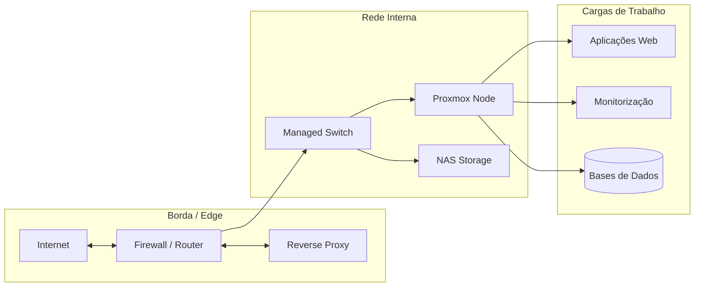

# 🏛️ Visão Geral da Arquitetura

Esta secção descreve os princípios e o desenho de alto nível que orientam a infraestrutura do Homelab.

---

## 📐 Princípios de Design

1. **Isolamento e Segurança (Zero Trust mindset):**
    - Nenhum dispositivo IoT ou convidado deve comunicar diretamente com a rede de servidores.
    - Acesso remoto restrito via VPN (Tailscale / WireGuard) ou Reverse Proxy autenticado.

2. **Modularidade e Reprodutibilidade:**
    - Toda a infraestrutura e serviços devem ser reproduzíveis através de ficheiros de configuração (Compose, Ansible).
    - Separação clara entre *Compute*, *Storage* e *Networking*.

3. **Resiliência e Recuperação de Desastres:**
    - Estratégia de backup 3-2-1.
    - Backups automáticos diários de VMs e ficheiros de configuração.

---

## 🗺️ Mapa de Infraestrutura

---

## 🔗 Próximos Passos
- Ver os detalhes de segmentação em [Topologia de Rede & VLANs](rede.md).
- Consultar a estratégia de proteção em [Segurança & Acessos](seguranca.md).
