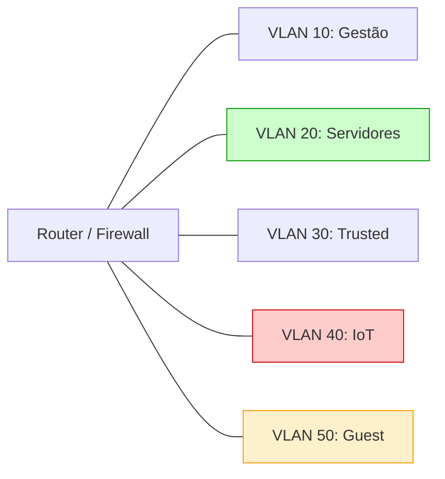

# 🌐 Topologia de Rede & VLANs

A rede do Homelab é segmentada através de VLANs para isolar tráfego e garantir que dispositivos de risco (ex: IoT) não tenham acesso aos servidores de produção.

---

## 📑 Tabela de Sub-redes e VLANs

| VLAN ID | Nome | Sub-rede CIDR | Descrição | Isolamento |
| :--- | :--- | :--- | :--- | :--- |
| **VLAN 1 / 10** | `MGMT` | `192.168.10.0/24` | Gestão de switches, router, Proxmox e IPMI/iDRAC | Total |
| **VLAN 20** | `SERVERS` | `192.168.20.0/24` | Servidores, VMs e containers de serviços | Acesso controlado |
| **VLAN 30** | `TRUSTED` | `192.168.30.0/24` | Dispositivos pessoais (PCs, portáteis, telemóveis) | Acesso a SERVERS |
| **VLAN 40** | `IOT` | `192.168.40.0/24` | Lâmpadas, sensores, câmaras, assistentes de voz | Sem acesso à LAN |
| **VLAN 50** | `GUEST` | `192.168.50.0/24` | Rede isolada para convidados | Apenas Internet |

---

## 🛡️ Regras de Firewall Principais

- **IoT -> LAN:** Bloqueado (DROP por padrão).
- **IoT -> Internet:** Permitido apenas para serviços essenciais (ou NTP/DNS restrito).
- **Guest -> LAN:** Bloqueado por completo.
- **Trusted -> Servers:** Permitido para portas autorizadas (HTTP/S, SSH, NFS).
- **DNS:** Todas as VLANs são forçadas a resolver via DNS interno (AdGuard Home / Pi-hole) com bloqueio de anúncios e trackers.

---

## 🗺️ Diagrama de Segmentação

