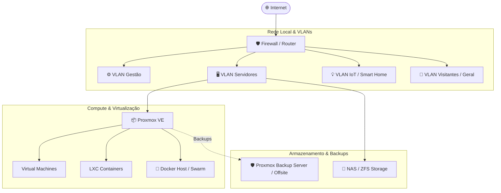

# 🏠 Bem-vindo ao meu Homelab

> **Um ambiente pessoal de computação, testes, automação e self-hosting.**

Este site serve como **portefólio técnico** e **documentação viva** da minha infraestrutura doméstica. Aqui documento as decisões de arquitetura, topologia de rede, virtualização, serviços auto-hospedados (*self-hosted*) e práticas de DevOps / IaC.

---

## 🎯 Objetivos do Projeto

- 🚀 **Aprendizagem Contínua:** Experimentar tecnologias de virtualização, redes empresariais, automação e observabilidade.
- 🔒 **Privacidade & Controlo de Dados:** Ter total posse e soberania sobre dados pessoais, serviços de cloud e media.
- ⚡ **Alta Disponibilidade & Eficiência:** Garantir serviços resilientes, backups fiáveis e baixo consumo energético.
- 🛠️ **Práticas de Infraestrutura como Código (IaC):** Automatizar o provisionamento e manutenção através de Ansible, Docker e GitOps.

---

## 📊 Visão Rápida da Infraestrutura

---

## 🧭 Navegação Rápida

| Secção | Descrição |
| :--- | :--- |
| [**Arquitetura & Rede**](arquitetura/geral.md) | Visão geral da rede, segmentação por VLANs, regras de firewall e acessos seguros (VPN). |
| [**Infraestrutura & Hardware**](infraestrutura/hardware.md) | Especificações dos servidores, nós de computação, switches e soluções de armazenamento. |
| [**Serviços & Aplicações**](servicos/catalogo.md) | Catálogo de aplicações self-hosted (media, produtividade, DNS, autenticação). |
| [**DevOps & IaC**](devops/iac.md) | Playbooks de Ansible, automação com Docker Compose / Terraform e pipelines CI/CD. |
| [**Projetos & Guias**](projetos/guias.md) | Tutoriais passo-a-passo, runbooks de recuperação e registo de melhorias. |

---

## 💡 Tech Stack Principal

- **Virtualização:** Proxmox VE / LXC / KVM
- **Contentorização:** Docker & Docker Compose
- **Redes & VPN:** WireGuard / Tailscale, Nginx Proxy Manager / Traefik, AdGuard Home / Pi-hole
- **Observabilidade:** Prometheus, Grafana, Uptime Kuma
- **Automação:** Ansible, GitHub Actions, Bash scripts
