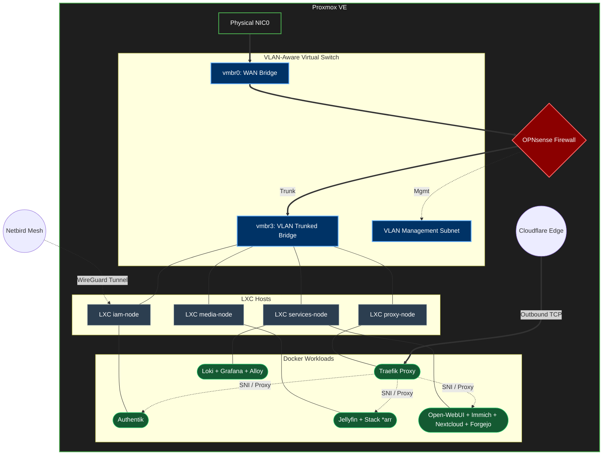

# 🖥️ Infrastructure & Networking

A holistic view of the homelab's hardware hosting, networking architecture, and virtualization model.

---

## 🏗️ Topology & Logical Networks

Workloads run on virtualized computing resources managed by a **Proxmox VE (PVE)** hypervisor. Traffic routing, firewall rules, and network segregation are handled centrally by a virtualized **OPNsense** appliance.

*   **Virtualization:** Isolation of core workloads inside LXC containers running nested Docker engines.
*   **Virtual Switching:** The physical network interface (`vmbr0`) connects directly to the OPNsense WAN interface. A secondary bridge (`vmbr3`) operates in **VLAN-Aware (802.1Q)** mode to segregate subnets across LXC hosts.
*   **Out-of-Band Management (OOB):** Isolated in a dedicated management VLAN to secure local administrative access.

---

## 🌐 External Access & Ingress Routing

1.  **Zero-Exposure Ingress:** WAN interfaces do not expose any direct NAT rules (port forwarding). Inbound HTTPS traffic is securely routed via outbound connections established by a **Cloudflare Tunnel** daemon terminating at the internal reverse proxy.
2.  **Secure Mesh Network:** Remote administrative access and host-to-host connectivity are provided by **Netbird**, a WireGuard-based overlay mesh VPN.

---

## 🗺️ Architecture Diagram

---

## 🛠️ LXC Nodes Breakdown

*   **Proxy Node (Edge Routing):** Handles SSL/TLS termination, automated ACME Let's Encrypt DNS-01 validation challenges, and request dispatching. Runs **Traefik** and **Cloudflared**.
*   **IAM Core Node (Identity & VPN):** Centralizes user management, acts as an OIDC/SAML provider, and manages WAN connectivity. Runs **Authentik** and the **Netbird** client.
*   **Media Node (Acquisition & Streaming):** Dedicated to media management and transcoding, featuring local hardware GPU passthrough to expedite H.264/HEVC encoding. Runs **Jellyfin** and the media downloader pipeline.
*   **Private Services Node (Data & Observability):** Houses shared repositories, document clouds, localized machine learning instances, and metrics ingestion. Runs **Nextcloud**, **Immich**, **Forgejo Git**, **Open-WebUI**, and the telemetry engine (**Loki / Grafana / Alloy**).
