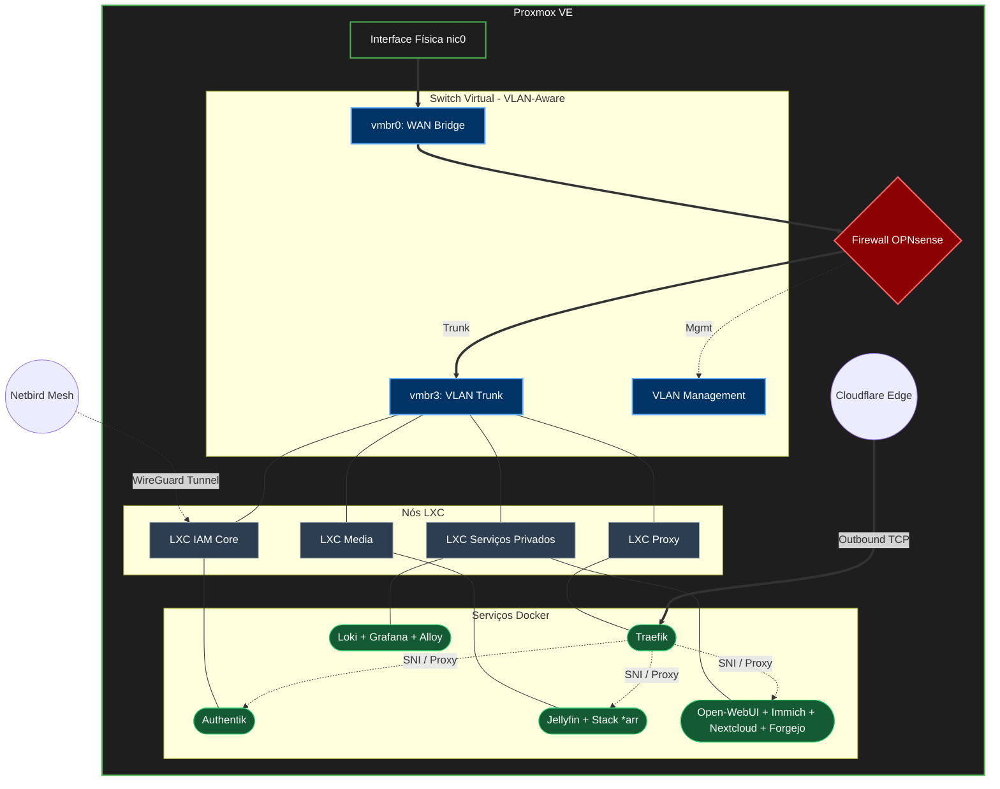

# 🖥️ Infraestrutura & Rede

Visão holística da infraestrutura, arquitetura de rede e modelo de virtualização do homelab.

---

## 🏗️ Topologia e Redes Lógicas

O ambiente é virtualizado sobre um hypervisor **Proxmox VE (PVE)**. O encaminhamento do tráfego, as regras de firewall e a segregação de redes são geridos centralmente por uma instância virtualizada do **OPNsense**.

*   **Virtualização:** Segregação de workloads em contentores LXC rodando instâncias de Docker integradas.
*   **Comutação Virtual:** A ponte física (`vmbr0`) liga-se diretamente ao OPNsense (WAN). Uma bridge secundária (`vmbr3`) opera em modo **VLAN-Aware (802.1Q)** para segmentar as subnets entre cada nó LXC.
*   **Gestão Out-of-Band (OOB):** Isolada numa VLAN específica de gestão para acesso administrativo seguro.

---

## 🌐 Acesso Externo e Conetividade

1.  **Ingress sem Exposição:** Não existem regras de NAT direto (port forwarding) na WAN pública. Todo o tráfego de entrada legítimo (HTTP/HTTPS) é encaminhado através de ligações de saída (Outbound) estabelecidas por um daemon do **Cloudflare Tunnel** até ao proxy reverso interno.
2.  **Rede Mesh Segura:** O acesso administrativo remoto e interligação de nós faz-se através do **Netbird**, uma VPN em malha baseada no protocolo WireGuard.

---

## 🗺️ Diagrama de Arquitetura

---

## 🛠️ Especificação dos Nós LXC

*   **Nó Proxy (Edge Routing):** Responsável por fazer a terminação TLS, renovação de certificados DNS-01 e proxy de tráfego. Corre **Traefik** e **Cloudflared**.
*   **Nó IAM Core (Segurança e Identidade):** Centralização de credenciais, provedor OIDC/SAML e VPN. Corre **Authentik** e o cliente **Netbird**.
*   **Nó Media (Multimédia e Automação):** Gerenciamento e streaming de conteúdo. Corre **Jellyfin** (com transcodificação por hardware via passthrough de GPU integrado) e a stack de aquisição de média.
*   **Nó Serviços Privados (Dados & Observabilidade):** Armazenamento de ficheiros, stack de inteligência artificial local e telemetria. Corre **Nextcloud**, **Immich**, **Forgejo Git**, **Open-WebUI** e a stack de SRE (**Loki / Grafana / Alloy**).
