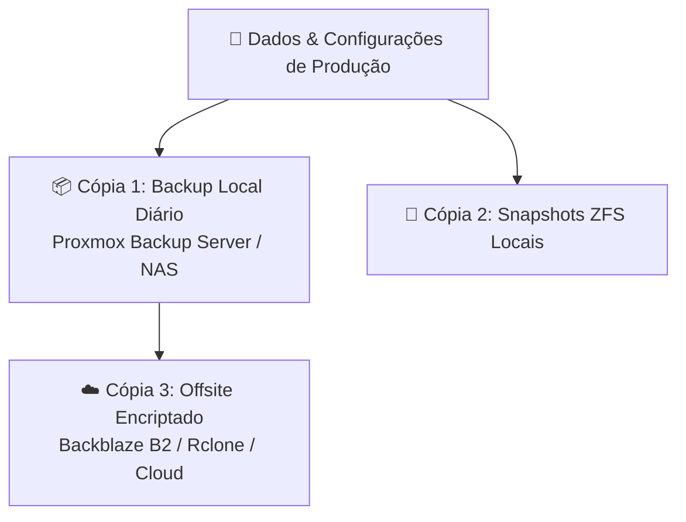

# 💾 Armazenamento & Estratégia de Backups

Política de armazenamento, pools de dados e estratégia de recuperação de desastres.

---

## 📂 Organização do Armazenamento

- **Armazenamento de Alta Velocidade (NVMe/SSD):**
  - Sistema operativo do Hypervisor.
  - Discos virtuais de VMs e containers para máxima performance de I/O.
- **Armazenamento de Massa (ZFS / HDDs):**
  - Armazenamento de media, documentos e snapshots.
  - Partilhas centralizadas (NFS para servidores, SMB para clientes finais).

---

## 🛡️ Estratégia de Backup 3-2-1

### Regras de Execução:
1. **3 Cópias** dos dados importantes.
2. **2 Tipos de suporte** diferentes (SSD/ZFS local + NAS de backup).
3. **1 Cópia externa** (offsite em cloud ou disco secundário noutro local).

- **Frequência:** Snapshots diários retidos por 7 dias, backups semanais retidos por 4 semanas, backups mensais por 6 meses.
