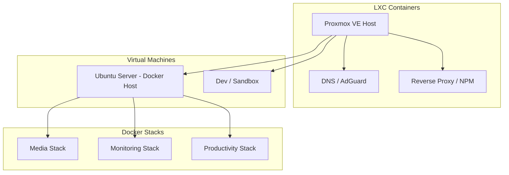

# 📦 Virtualização & Contentorização

Estratégia de execução de cargas de trabalho utilizando Proxmox VE e Docker.

---

## 🏗️ Camada de Virtualização (Proxmox VE)

O **Proxmox Virtual Environment (PVE)** é o hypervisor tipo 1 (bare-metal) principal do Homelab.

### Vantagens do Setup:
- **LXC Containers:** Utilizados para a maioria dos serviços leves devido à sua eficiência quase nativa e baixo consumo de RAM/CPU.
- **KVM Virtual Machines:** Utilizadas para sistemas operativos completos, isolamento de ambientes Docker dedicados ou nós de Kubernetes.

---

## 🐳 Contentorização (Docker)

A gestão dos contentores segue o princípio de **Infraestrutura como Código**:

- Cada serviço possui a sua pasta dedicada com ficheiro `compose.yaml`.
- Ficheiros `.env` isolados para segredos e variáveis de ambiente (nunca comitados em git).
- Volumes de dados persistentes mapeados para diretórios locais ou partilhas NFS.

