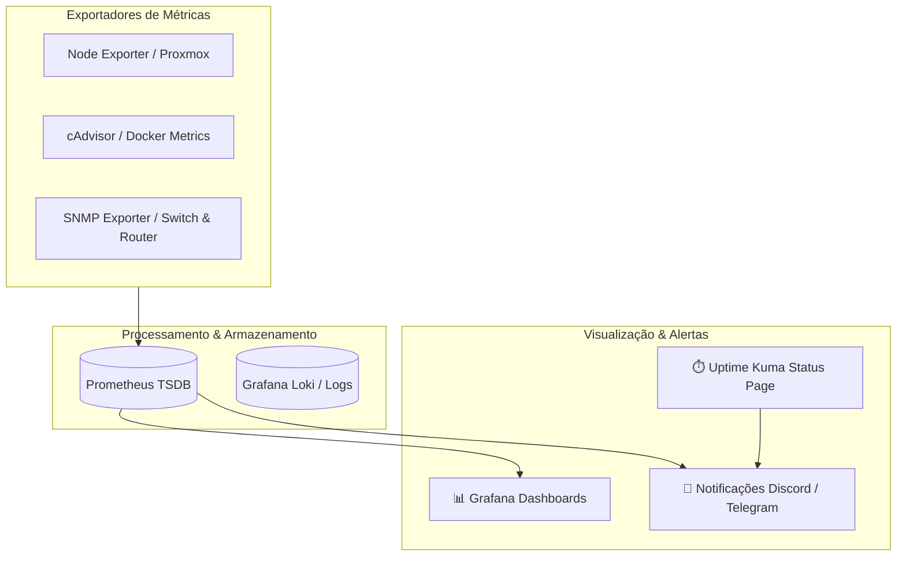

# 📈 Monitorização & Observabilidade

A infraestrutura possui monitorização contínua de integridade, telemetria e alertas proativos para evitar indisponibilidades.

---

## 🔍 Stack de Observabilidade

---

## 🔔 Política de Alertas
- **Uptime Kuma:** Testa a cada 60 segundos se as portas e endpoints HTTP estão saudáveis (`200 OK`).
- **Notificações:** Enviadas via webhook para um canal privado do Discord ou Telegram no caso de:
  - Serviço offline há mais de 2 minutos.
  - Uso de disco > 85%.
  - Temperatura de CPU anómala.
